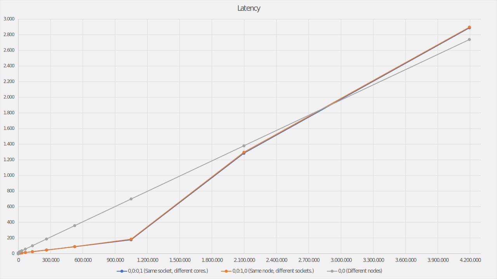
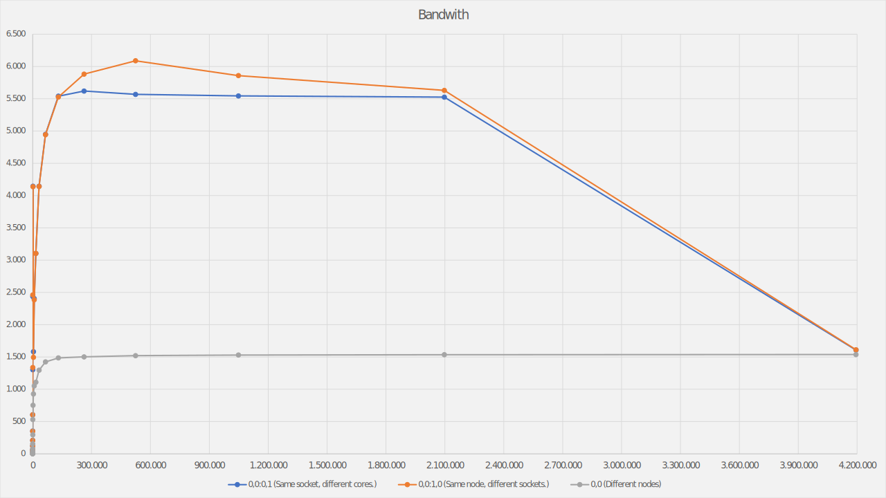

# Assignment 1

## Exercise 1

In my opinion, the five most important parameters when submitting a job are:

- `-pe` because it is needed to set up the parallel environment
- `-o` to customize the output file name
- `-e` to log errors for debugging into a separate file
- `-cwd` so the output/log files are written in the current directory
- `-N` to easily check the status using `qstat -j`

To run the program in parallel, we need to set the `-pe` to `openmpi-*perhost`.

## Exercise 2

###  Latency Test

| Size    | 0,0:0,1 | 0,0:1,0 |     0,0 |
|---------|---------|---------|---------|
| 0       |    0.41 |    0.44 |    3.54 |
| 1       |    0.48 |    0.48 |    3.57 |
| 2       |    0.48 |    0.48 |    3.57 |
| 4       |    0.48 |    0.49 |    3.58 |
| 8       |    0.48 |    0.49 |    3.63 |
| 16      |    0.50 |    0.51 |    3.66 |
| 32      |    0.50 |    0.51 |    3.69 |
| 64      |    0.55 |    0.55 |    3.86 |
| 128     |    0.58 |    0.58 |    4.86 |
| 256     |    0.62 |    0.62 |    5.36 |
| 512     |    0.88 |    0.88 |    6.15 |
| 1024    |    1.03 |    1.02 |    7.28 |
| 2048    |    1.32 |    1.31 |    9.97 |
| 4096    |    3.99 |    3.99 |   12.63 |
| 8192    |    4.93 |    4.95 |   18.44 |
| 16384   |    6.63 |    6.63 |   26.17 |
| 32768   |    9.25 |    9.29 |   36.78 |
| 65536   |   14.54 |   14.61 |   57.79 |
| 131072  |   24.91 |   25.26 |  100.51 |
| 262144  |   45.76 |   46.11 |  187.21 |
| 524288  |   88.14 |   90.06 |  358.16 |
| 1048576 |  177.20 |  184.89 |  699.05 |
| 2097152 | 1284.09 | 1296.78 | 1379.27 |
| 4194304 | 2889.40 | 2898.48 | 2739.78 |

### Bandwidth Test

| Size    | 0,0:0,1 | 0,0:1,0 |     0,0 |
|---------|---------|---------|---------|
| 1       |    4.22 |    4.25 |    0.63 |
| 2       |    8.51 |    8.58 |    1.26 |
| 4       |   17.07 |   17.23 |    2.52 |
| 8       |   34.21 |   34.38 |    5.09 |
| 16      |   59.86 |   60.57 |   10.26 |
| 32      |  120.56 |  123.02 |   20.47 |
| 64      |  207.80 |  207.03 |   40.66 |
| 128     |  353.15 |  349.04 |   77.96 |
| 256     |  605.31 |  604.72 |  153.10 |
| 512     | 1302.63 | 1335.86 |  294.74 |
| 1024    | 2437.19 | 2460.93 |  530.24 |
| 2048    | 4144.44 | 4137.33 |  751.70 |
| 4096    | 1581.87 | 1494.66 |  926.52 |
| 8192    | 2404.65 | 2385.47 | 1052.46 |
| 16384   | 3104.12 | 3103.71 | 1107.96 |
| 32768   | 4144.78 | 4141.17 | 1295.17 |
| 65536   | 4948.23 | 4942.83 | 1423.33 |
| 131072  | 5539.60 | 5525.82 | 1485.10 |
| 262144  | 5619.38 | 5882.07 | 1501.41 |
| 524288  | 5567.90 | 6088.44 | 1520.11 |
| 1048576 | 5544.25 | 5858.56 | 1530.15 |
| 2097152 | 5524.71 | 5629.41 | 1535.16 |
| 4194304 | 1607.25 | 1610.91 | 1537.59 |

