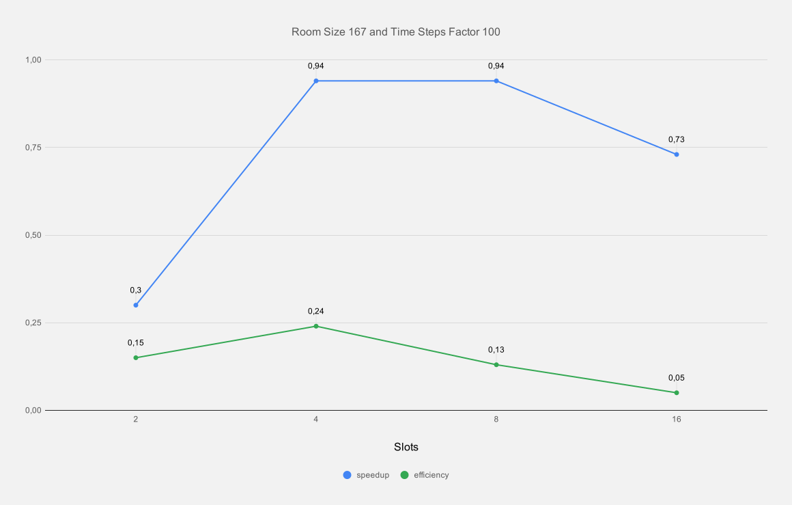

# Assignment 3

## Exercise 2 - heat stencil 2D

### Results for room size 167

| slots | time steps | result (ms) | speedup | efficiency |
|-------|------------|-------------| ------- | ---------- |
| 1     | 100        | 2602        |         |            |
| 2     | 100        | 8735        | 0,30    | 0,15       |
| 4     | 100        | 2742        | 0,94    | 0,24       |
| 8     | 100        | 2773        | 0,94    | 0,13       |
| 16    | 100        | 3542        | 0,73    | 0,05       |

### Results for room size 243

| slots | time steps | result (ms) | speedup | efficiency |
|-------|------------|-------------| ------- | ---------- |
| 1     | 100        | 7612        |         |            |
| 2     | 100        | 26534       | 0,29    | 0,15       |
| 4     | 100        | 7629        | 1,00    | 0,25       |
| 8     | 100        | 7655        | 1,00    | 0,13       |
| 16    | 100        | 6219        | 1,22    | 0,08       |

### Results for room size 500

| slots | time steps | result (ms) | speedup | efficiency |
|-------|------------|-------------| ------- | ---------- |
| 1     | 100        | 63930       |         |            |
| 2     | 100        | 229835      | 0,28    | 0,14       |
| 4     | 100        | 62305       | 1,03    | 0,26       |
| 8     | 100        | 62330       | 1,03    | 0,13       |
| 16    | 100        | 25066       | 2,55    | 0,16       |

For our measurement, we used strong scalability because it shows at what threshold a parallel version actually performs better than the sequential version.

In our measurements we can observe that we only gain any significant speedup with a big enough problem size (500) and going from 4 slots to 16.

## Exercise 2 - heat stencil 3D

| room size | time steps | time (in ms) |
|-----------|------------|--------------|
| 30        | 500        | 3361         |
| 40        | 500        | 18524        |
| 50        | 500        | 45041        |

