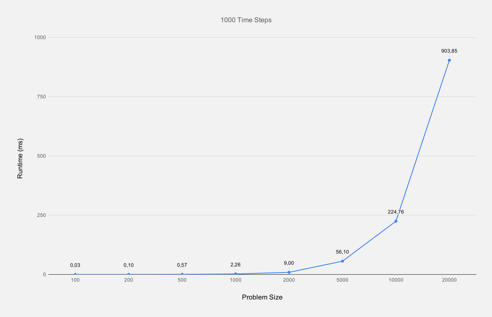

# Assignment 5

## Exercise 1

| Problem Size | Time Steps | Runtime |
|-------------:|-----------:|--------:|
|          100 |       1000 |    0.03 |
|          200 |       1000 |    0.10 |
|          500 |       1000 |    0.57 |
|         1000 |       1000 |    2.26 |
|         2000 |       1000 |    9.00 |
|         5000 |       1000 |   56.10 |
|        10000 |       1000 |  224.76 |
|        20000 |       1000 |  903.85 |

## Exercise 2

### What optimization methods can you come up with in order to improve the performance of Exercise 1?

Remove usage of `powf` in favour of simple multiplications. Also remove redundant calculations. In the sense that we could change `force = G * (mass_1 * mass_2) / radius^2` to `force = G * (mass_1 * mass_2) / radius^2 * dt`, so we do not have to multiply `dt` and then divide by the mass of the particle and instead only have to multiply the force with the mass for the velocity of each particle.

### What parallelization strategies would you consider for Exercise 1 and why?

For parallelizing exercise 1, our strategy will be to split the problem into chunks of particles and distribute those among the ranks. For every particle, we need the next particle in order to calculate the velocity, so we only need to send two particles between two chunks and can calculate the velocity and position of the other particles pairwise independently.

With this method the communication overhead should not be too bad, while still maintaining good distribution of work among the ranks.
