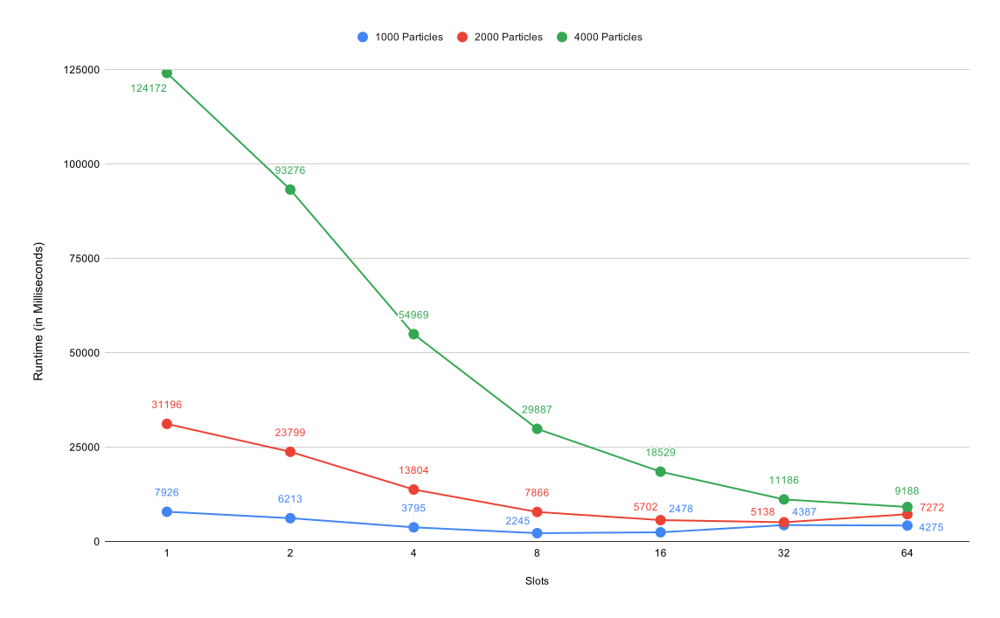
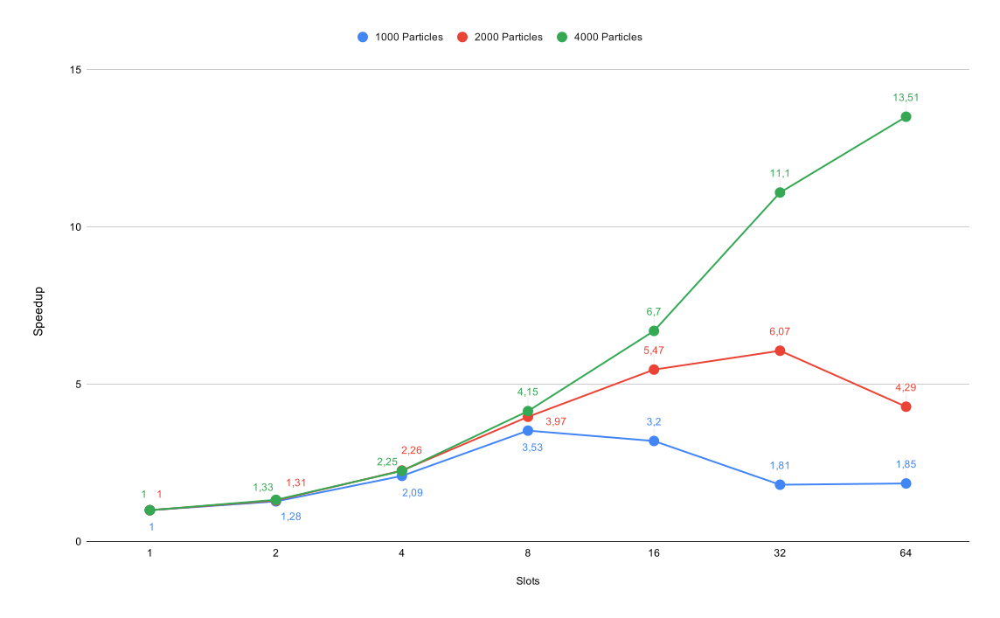

# Assignment 6

## Exercise 1

### Results for particle size 1000

| slots | time steps | result (ms) | speedup | efficiency |
|-------|------------|-------------| ------- | ---------- |
| 1     | 1000       | 7926        |         |            |
| 2     | 1000       | 6213        | 1,28    | 0,64       |
| 4     | 1000       | 3795        | 2,09    | 0,52       |
| 8     | 1000       | 2245        | 3,53    | 0,44       |
| 16    | 1000       | 2478        | 3,20    | 0,20       |
| 32    | 1000       | 4387        | 1,81    | 0,05       |
| 64    | 1000       | 4275        | 1,85    | 0,03       |

### Results for particle size 2000

| slots | time steps | result (ms) | speedup | efficiency |
|-------|------------|-------------| ------- | ---------- |
| 1     | 2000       | 31196       |         |            |
| 2     | 2000       | 23799       | 1,31    | 0,65       |
| 4     | 2000       | 13804       | 2,26    | 0,56       |
| 8     | 2000       | 7866        | 3,97    | 0,50       |
| 16    | 2000       | 5702        | 5,47    | 0,34       |
| 32    | 2000       | 5138        | 6,07    | 0,19       |
| 64    | 2000       | 7272        | 4,29    | 0,07       |

### Results for particle size 4000

| slots | time steps | result (ms) | speedup | efficiency |
|-------|------------|-------------| ------- | ---------- |
| 1     | 4000       | 124172      |         |            |
| 2     | 4000       | 93276       | 1,33    | 0,67       |
| 4     | 4000       | 54969       | 2,25    | 0,56       |
| 8     | 4000       | 29887       | 4,15    | 0,52       |
| 16    | 4000       | 18529       | 6,70    | 0,42       |
| 32    | 4000       | 11186       | 11,10   | 0,35       |
| 64    | 4000       | 9188        | 13,51   | 0,21       |

### Local Benchmarks

| slots | time steps | samples | runtime (s) |
| ----: | ---------: | ------: | ----------: |
|     1 |       1000 |    4000 |       32.69 |
|     2 |       1000 |    4000 |       24.59 |
|     4 |       1000 |    4000 |       14.43 |
|     8 |       1000 |    4000 |        8.03 |
|    16 |       1000 |    4000 |        6.79 |

