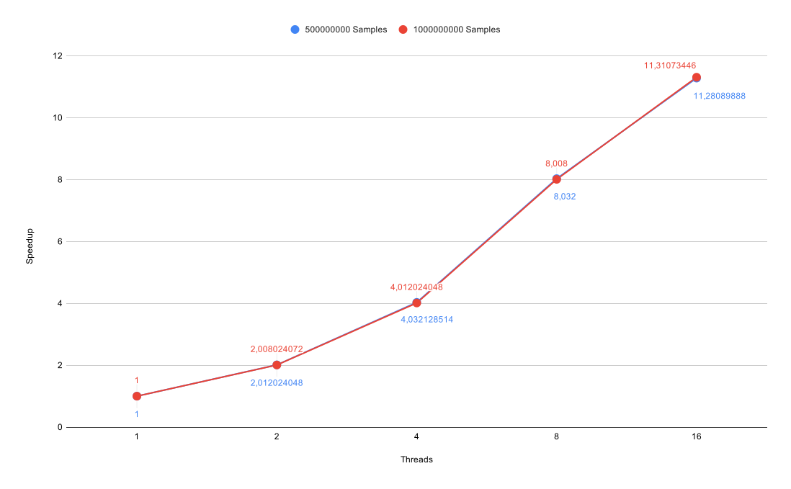
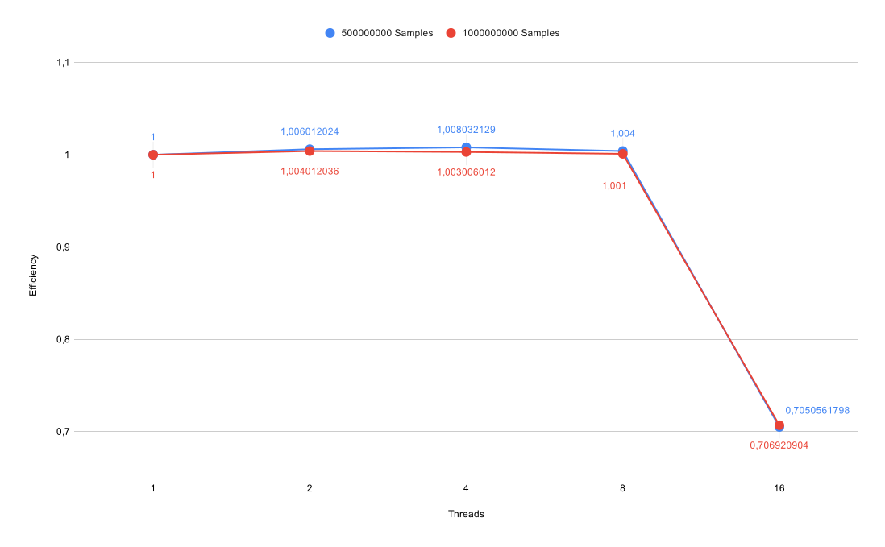
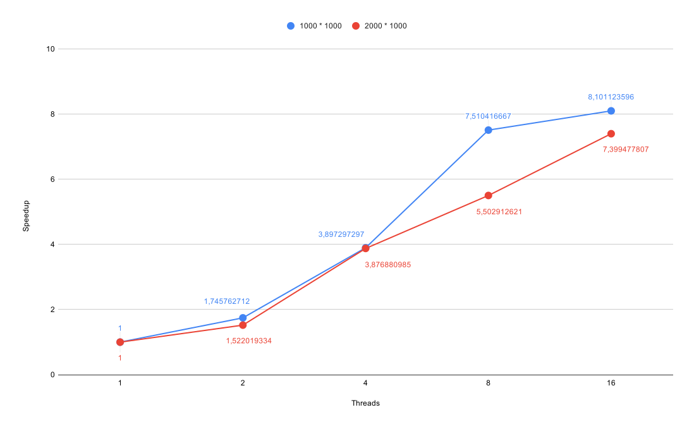
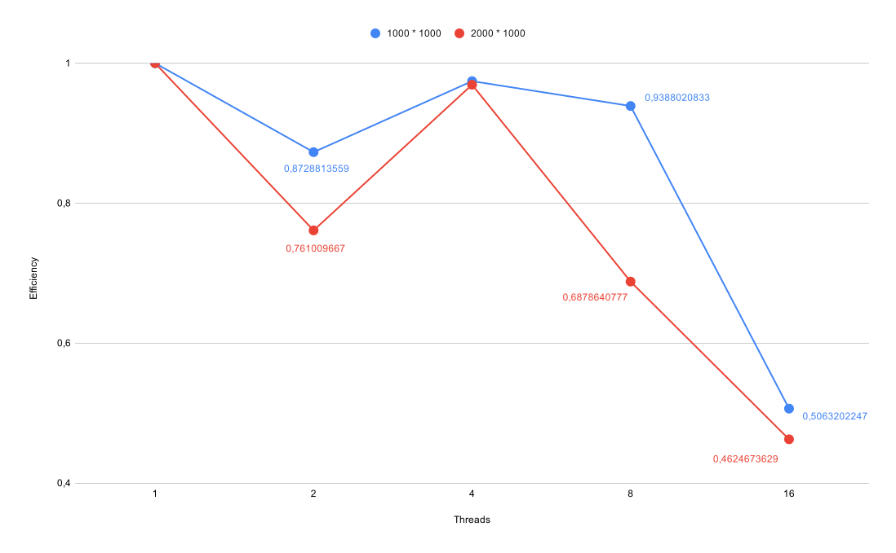
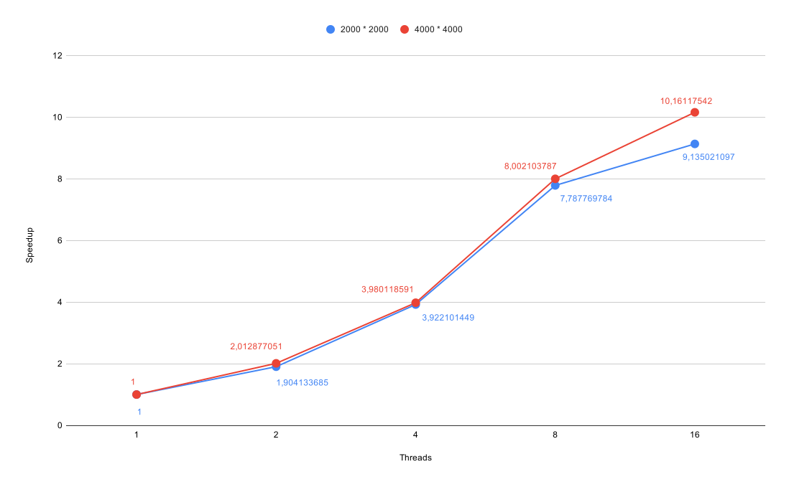
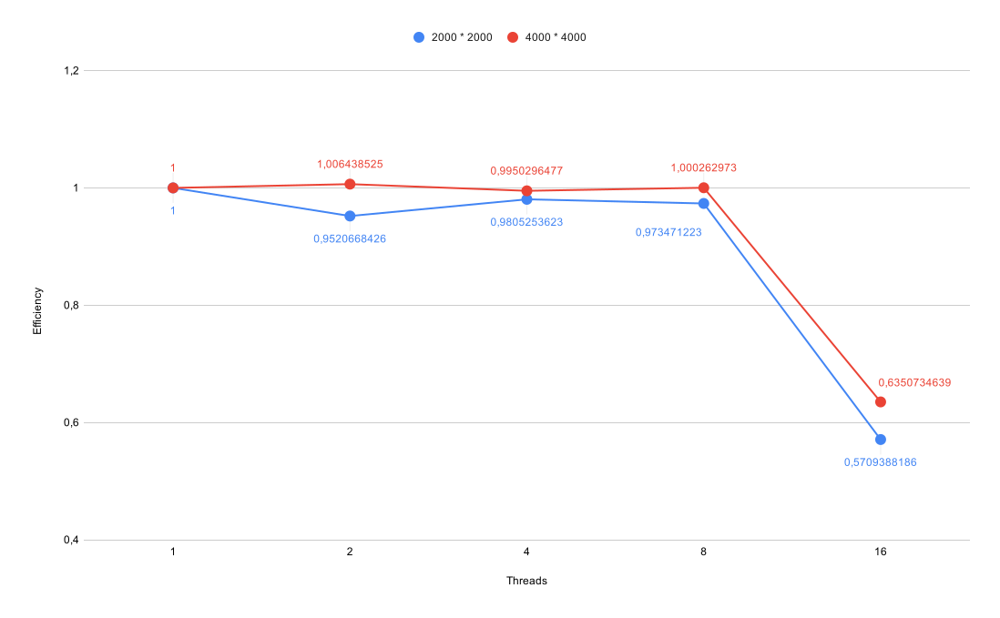

# Assignment 8

## Exercise 1

### Pi

| Problem Size | Threads | Runtime |
|--------------|---------|---------|
| 500000000    | 1       |  100400 |
| 500000000    | 2       |   49900 |
| 500000000    | 4       |   24900 |
| 500000000    | 8       |   12500 |
| 500000000    | 16      |   08900 |
| 1000000000   | 1       |  200200 |
| 1000000000   | 2       |   99700 |
| 1000000000   | 4       |   49900 |
| 1000000000   | 8       |   25000 |
| 1000000000   | 16      |   17700 |

the main parallelization step in this case is to use a `omp parallel reduction` in order to safely reduce on the `inside` variable.
The loop itself uses a conventional `omp for`.

### Heat Stencil

| Problem Size (Room Size * Time Steps) | Threads | Runtime |
|---------------------------------------|---------|---------|
| 1000 * 1000                           | 1       |   72100 |
| 1000 * 1000                           | 2       |   41300 |
| 1000 * 1000                           | 4       |   18500 |
| 1000 * 1000                           | 8       |    9600 |
| 1000 * 1000                           | 16      |    8900 |
| 2000 * 1000                           | 1       |  283400 |
| 2000 * 1000                           | 2       |  186200 |
| 2000 * 1000                           | 4       |   73100 |
| 2000 * 1000                           | 8       |   51500 |
| 2000 * 1000                           | 16      |   38300 |

Since we did not see any benefit in collapsing loops or any other optimization strategy, we just went for an ordinary `omp for`. However a `omp single` is still needed to safely swap buffers and print intermediate steps, since the whole region is "parallel".

## Exercise 2

### Matrix Multiplication

| Problem Size | Threads | Runtime |
|--------------|---------|---------|
| 2000 * 2000  | 1       |  216500 |
| 2000 * 2000  | 2       |  113700 |
| 2000 * 2000  | 4       |   55200 |
| 2000 * 2000  | 8       |   27800 |
| 2000 * 2000  | 16      |   23700 |
| 4000 * 4000  | 1       | 2282200 |
| 4000 * 4000  | 2       | 1133800 |
| 4000 * 4000  | 4       |  573400 |
| 4000 * 4000  | 8       |  285200 |
| 4000 * 4000  | 16      |  224600 |

For the matrix multiplication we actually saw a benefit in collapsing loops and therefore we decided on collapsing the outer two loops with `omp for collapse(2)`. The other loops use a standard `omp for`.

