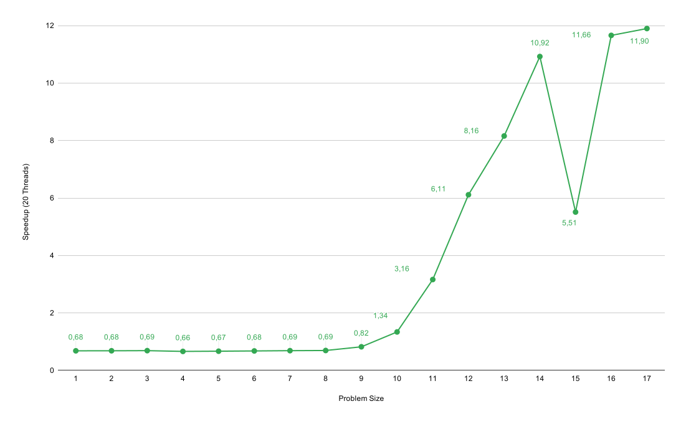
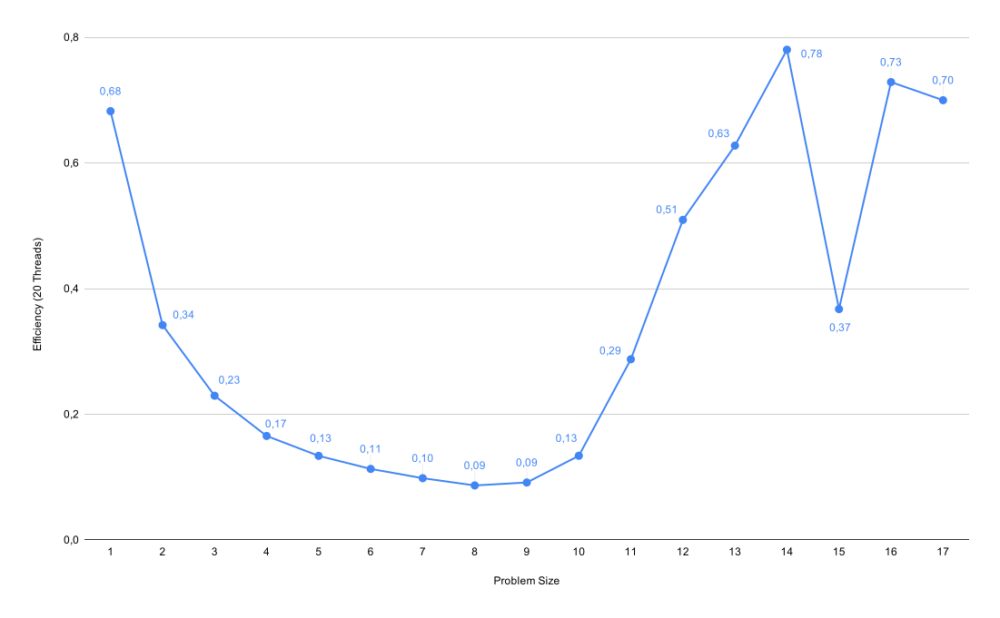

# Assignment 9

## Exercise 1: N-Queens Problem

### Implement a sequential version of the n-queens problem. Benchmark your program for several problem sizes. What can you observe?

In the sequential version, we can observe that the runtime grows exponentially relative to a given problem size. We were only able to calculate problem sizes up to 17 in a reasonable amount of time.

### Parallelize your program using OpenMP. Which OpenMP constructs are suitable candidates and why?

Our solution uses a conventional `omp parallel` for parallization and `omp atomic` for synchronization. More advanced constructs like `omp task` would not really be benefitial in our case.

### Benchmark your problem for several problem sizes and numbers of threads. What can you observe?

| Problem Size | Threads | Runtime (µs) |
|-------------:|--------:|-------------:|
| 1            | 1       |         2677 |
| 1            | 20      |         3923 |
| 2            | 1       |         2739 |
| 2            | 20      |         4006 |
| 3            | 1       |         2770 |
| 3            | 20      |         4024 |
| 4            | 1       |         2747 |
| 4            | 20      |         4151 |
| 5            | 1       |         2684 |
| 5            | 20      |         4013 |
| 6            | 1       |         2769 |
| 6            | 20      |         4085 |
| 7            | 1       |         2790 |
| 7            | 20      |         4058 |
| 8            | 1       |         2885 |
| 8            | 20      |         4160 |
| 9            | 1       |         3503 |
| 9            | 20      |         4260 |
| 10           | 1       |         6254 |
| 10           | 20      |         4670 |
| 11           | 1       |        20910 |
| 11           | 20      |         6611 |
| 12           | 1       |       103600 |
| 12           | 20      |        16950 |
| 13           | 1       |       599200 |
| 13           | 20      |        73450 |
| 14           | 1       |      3789000 |
| 14           | 20      |       346900 |
| 15           | 1       |     13380000 |
| 15           | 20      |      2428000 |
| 16           | 1       |    180000000 |
| 16           | 20      |     15440000 |
| 17           | 1       |   1421740000 |
| 17           | 20      |    119510000 |

We can see that until problem size 10, the runtime is insignificant. After that point, parallelization becomes beneficial.

The scalability of our program is dependant on the problem size. Every thread is assigned to one row of the board. For this reason systems with high thread count do not benefit from their threads if the problem size is lower than the thread count. So we should make the units of computation smaller so that actually all threads are working, even if the problem size is smaller.

### What are potential optimizations for this application?

We optimized the function to check for collisions from three loops (horizontal, vertical, diagonal) to just a single loop over the queens which are already placed.
