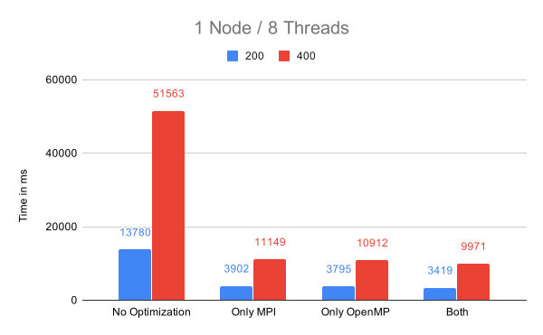
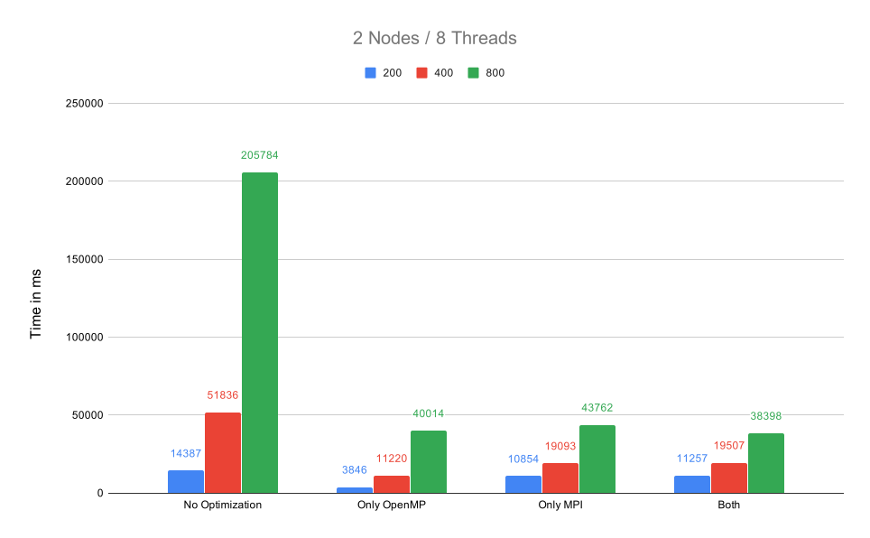

# Assignment 10

## Exercise 1

| Optimization | Runtime |
|--------------|---------|
| None         | 8.357 s |
| Only OpenMP  | 1.990 s |
| Only MPI     | 2.400 s |
| MPI & OpenMP | 1.765 s |

# MPI Optimization

For the MPI optimization, we changed our topology from 2D to 1D. Before the optimization, we split the rows and columns into equal chunks. Now we are splitting only the rows into slabs.

# OpenMP Optimization

For the OpenMP optimization, we used the `simd` pragma. We split the inner loop of the calculation into two loops in which the inner loop is vectorized. Additionally, we skipped the check for the heat source inside of the loop and instead reset the heat source after the loop.

# 1 Node / 8 Threads

| MPI Optimization | OpenMP Optimization | Problem Size | Runtime (ms) |
|------------------|---------------------|--------------|--------------|
| 0                | 0                   | 200          |        13915 |
| 0                | 1                   | 200          |         3640 |
| 1                | 0                   | 200          |         3786 |
| 1                | 1                   | 200          |         3445 |
| 0                | 0                   | 400          |        51485 |
| 0                | 1                   | 400          |        11064 |
| 1                | 0                   | 400          |        11267 |
| 1                | 1                   | 400          |         9992 |
| 0                | 0                   | 800          |       203855 |
| 0                | 1                   | 800          |        39670 |
| 1                | 0                   | 800          |        40354 |
| 1                | 1                   | 800          |        35799 |

# 2 Nodes / 8 Threads

| MPI Optimization | OpenMP Optimization | Problem Size | Runtime (ms) |
|------------------|---------------------|--------------|--------------|
| 0                | 0                   | 200          |        14044 |
| 0                | 1                   | 200          |         3846 |
| 1                | 0                   | 200          |        10854 |
| 1                | 1                   | 200          |        11257 |
| 0                | 0                   | 400          |        51836 |
| 0                | 1                   | 400          |        11220 |
| 1                | 0                   | 400          |        19093 |
| 1                | 1                   | 400          |        19507 |
| 0                | 0                   | 800          |       205784 |
| 0                | 1                   | 800          |        40014 |
| 1                | 0                   | 800          |        43762 |
| 1                | 1                   | 800          |        38398 |

# 3 Nodes / 8 Threads

| MPI Optimization | OpenMP Optimization | Problem Size | Runtime (ms) |
|------------------|---------------------|--------------|--------------|
| 0                | 0                   | 200          |        14202 |
| 0                | 1                   | 200          |         4229 |
| 1                | 0                   | 200          |        11423 |
| 1                | 1                   | 200          |        10837 |
| 0                | 0                   | 400          |        53696 |
| 0                | 1                   | 400          |        11291 |
| 1                | 0                   | 400          |        15943 |
| 1                | 1                   | 400          |        16100 |
| 0                | 0                   | 800          |       205110 |
| 0                | 1                   | 800          |        42364 |
| 1                | 0                   | 800          |        37164 |
| 1                | 1                   | 800          |        40041 |

# 4 Nodes / 8 Threads

| MPI Optimization | OpenMP Optimization | Problem Size | Runtime (ms) |
|------------------|---------------------|--------------|--------------|
| 0                | 0                   | 200          |        17807 |
| 0                | 1                   | 200          |        13717 |
| 1                | 0                   | 200          |        11556 |
| 1                | 1                   | 200          |        11578 |
| 0                | 0                   | 400          |        26801 |
| 0                | 1                   | 400          |        22498 |
| 1                | 0                   | 400          |        18280 |
| 1                | 1                   | 400          |        17931 |
| 0                | 0                   | 800          |        72091 |
| 0                | 1                   | 800          |        30970 |
| 1                | 0                   | 800          |        38842 |
| 1                | 1                   | 800          |        37114 |

# 8 Nodes / 8 Threads

| MPI Optimization | OpenMP Optimization | Problem Size | Runtime (ms) |
|------------------|---------------------|--------------|--------------|
| 0                | 0                   | 200          |        14955 |
| 0                | 1                   | 200          |        12591 |
| 1                | 0                   | 200          |        14302 |
| 1                | 1                   | 200          |        10952 |
| 0                | 0                   | 400          |        27282 |
| 0                | 1                   | 400          |        16842 |
| 1                | 0                   | 400          |        16974 |
| 1                | 1                   | 400          |        18995 |
| 0                | 0                   | 800          |        75191 |
| 0                | 1                   | 800          |        32851 |
| 1                | 0                   | 800          |        39221 |
| 1                | 1                   | 800          |        38570 |
